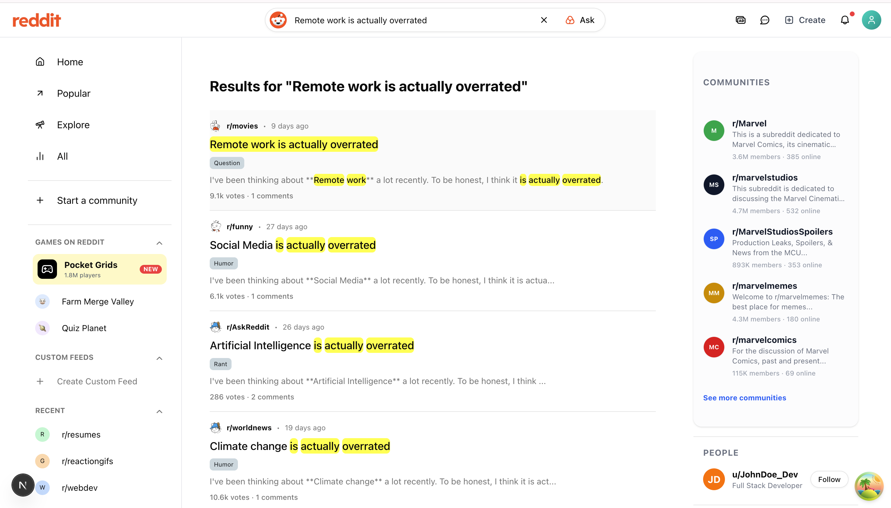

# Reddit Search Clone

## Description

This project is a frontend application for the Reddit Search Clone, built with Next.js and TypeScript to provide a fast, responsive, and user-friendly search experience. It consumes the backend search APIs to display subreddit-based results with pagination, keyword highlighting, and real-time suggestions.

## Getting Started

```bash
# Copy environment variables
cp .env.example .env

# Install dependencies
npm install

# Run development server
npm run dev
```


